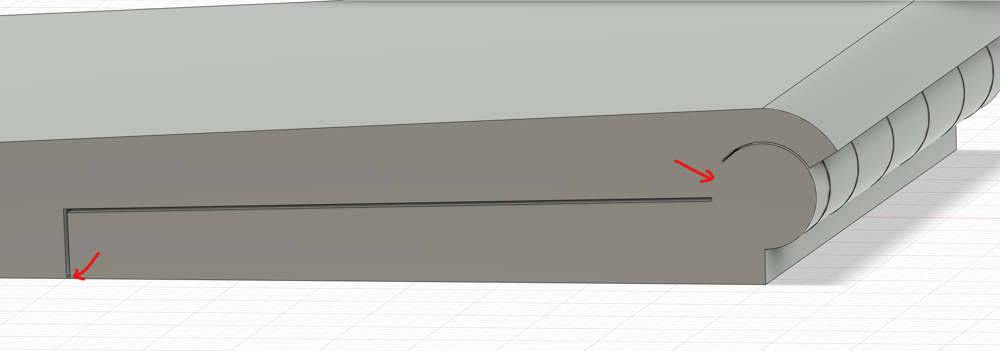
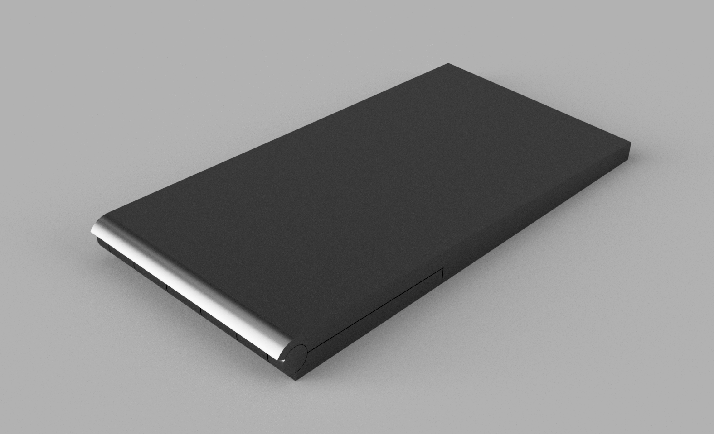
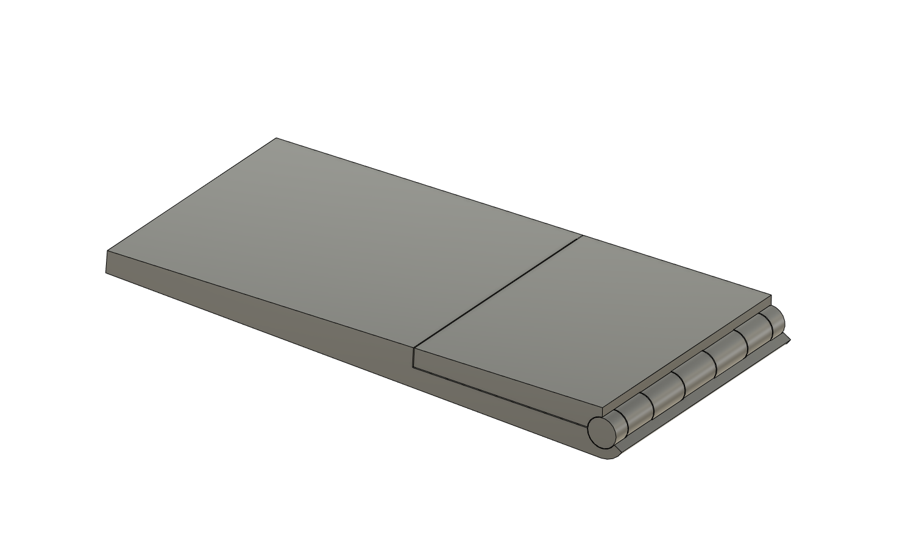
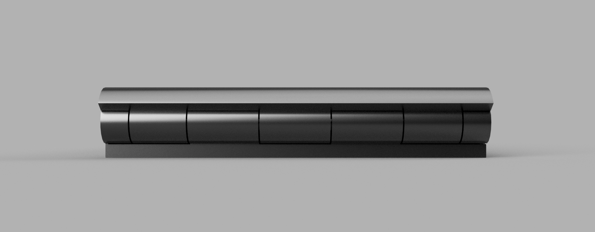
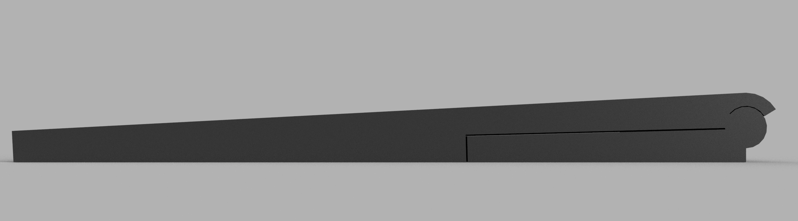
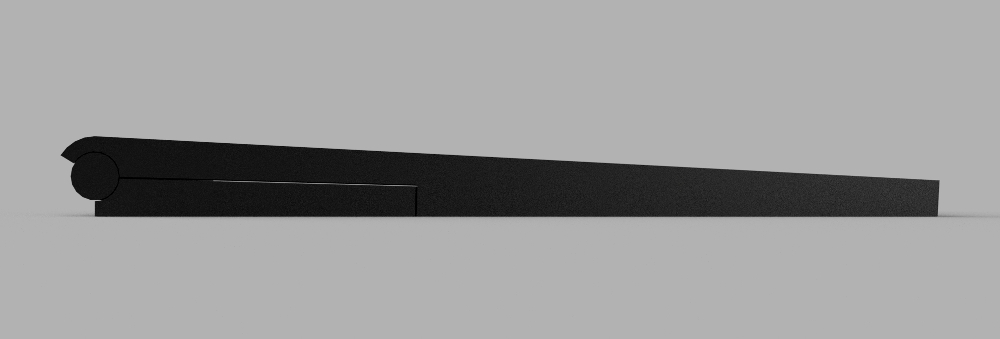
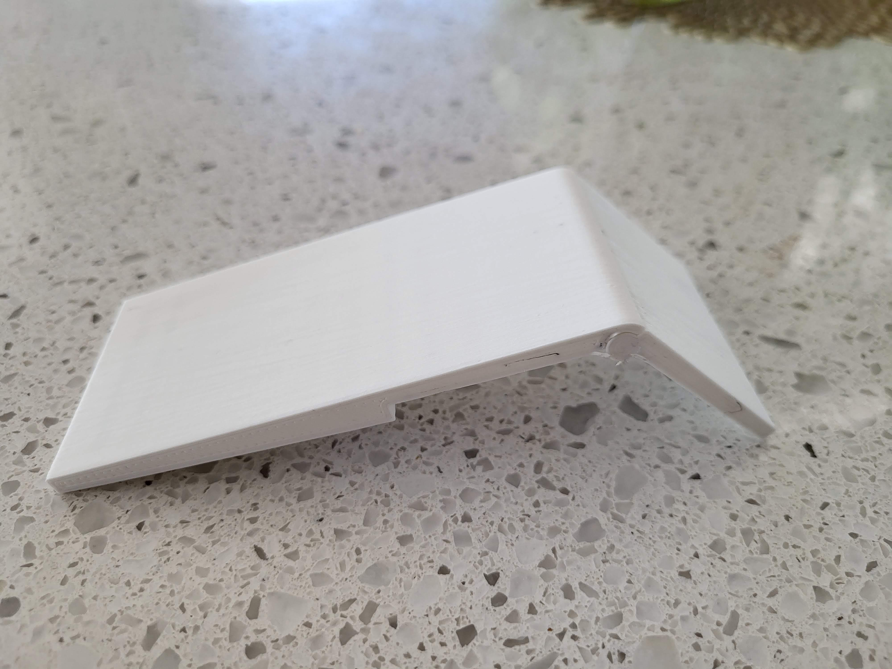
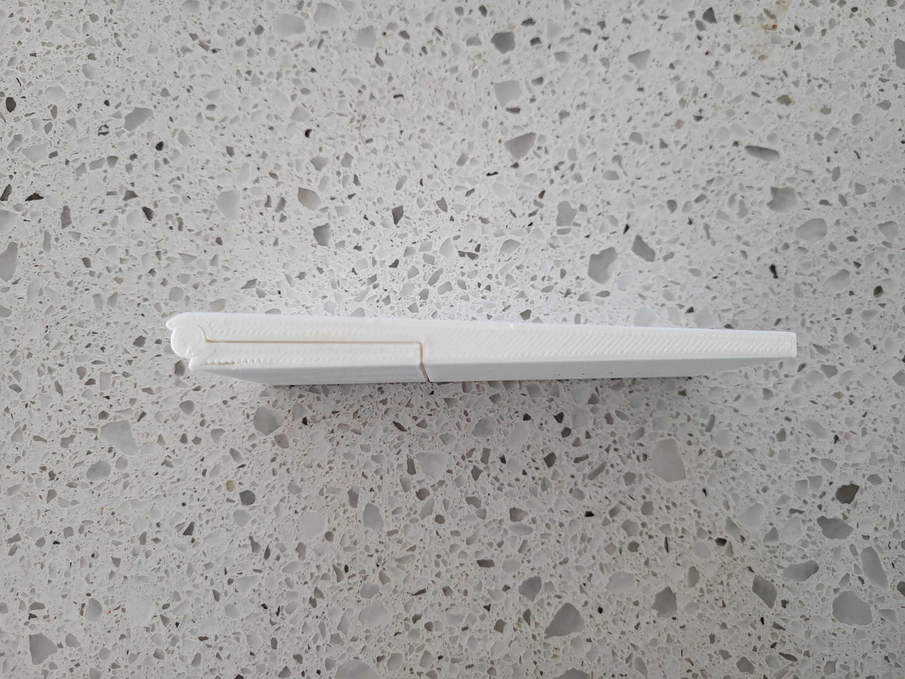

# print in place tenting stand

Simply put, this is a print in place tenting stand for devices. You velcro or glue the tenting stand to the back of your device that you want to tent, and you're done!  

Note: The original model / STL is fairly small, and I don't know that FDM printers will be able to print that precisely. In my test, I scaled this model up by 200%. I left the smaller version here, as it's easy to scale up, but you lose resolution as you scale down.  

Also, I left a slight connection between the parts so the stl will be printable in one piece (hence the print in place). On FDM printers, I recommend printing it on its side for the best results (least amount of supports).  

See pictures and video below  

