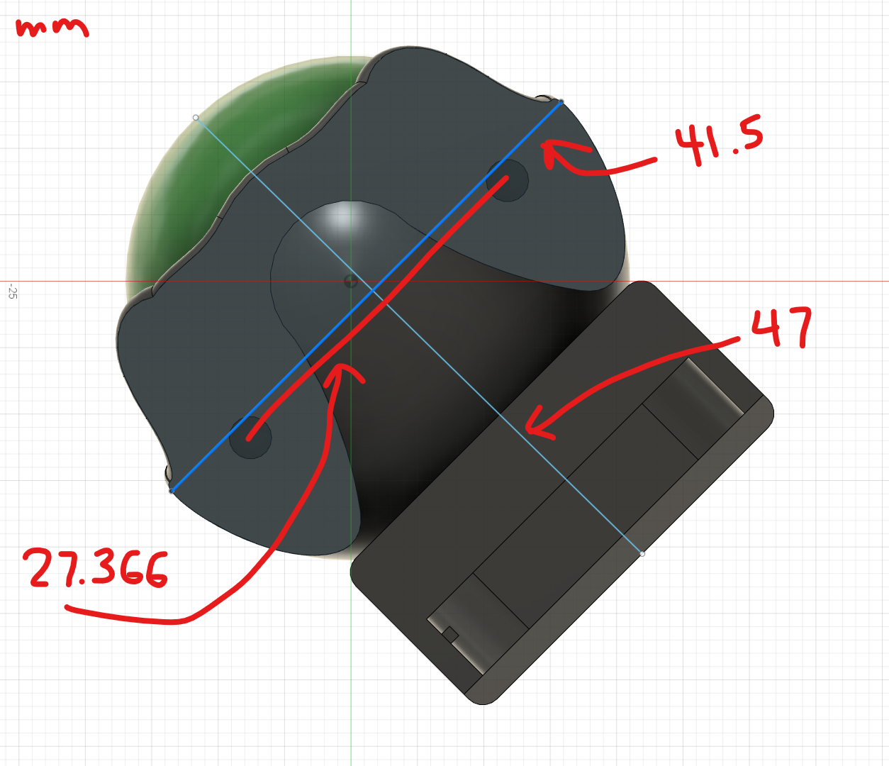
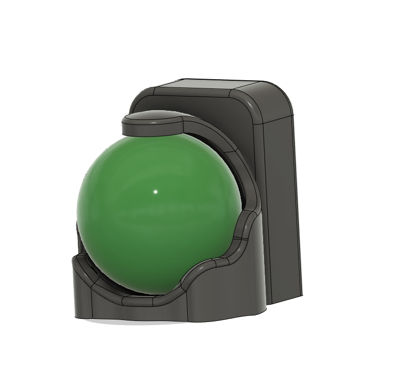
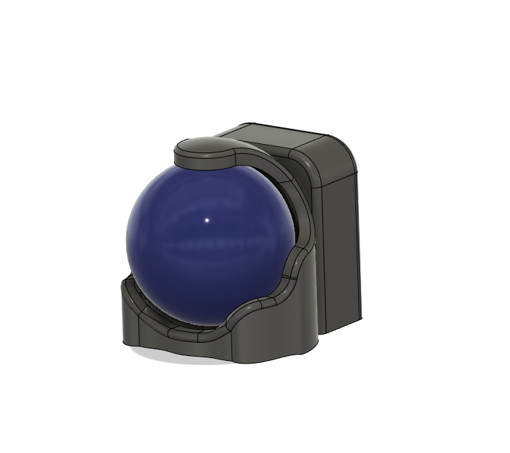
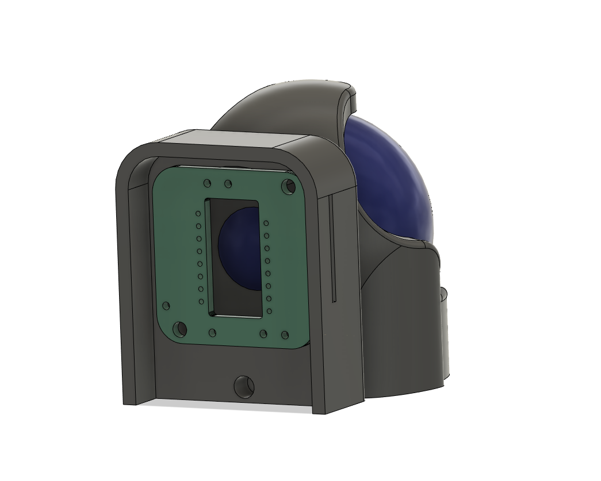
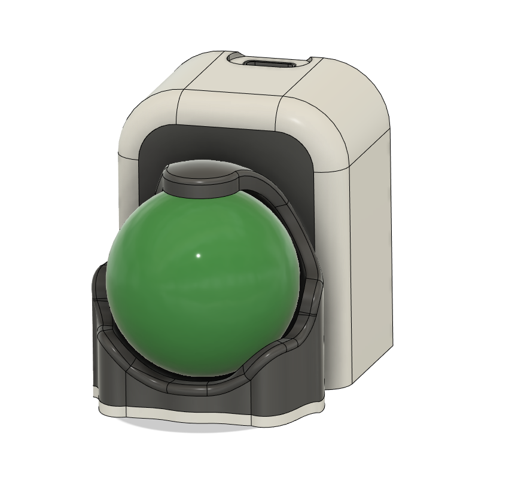
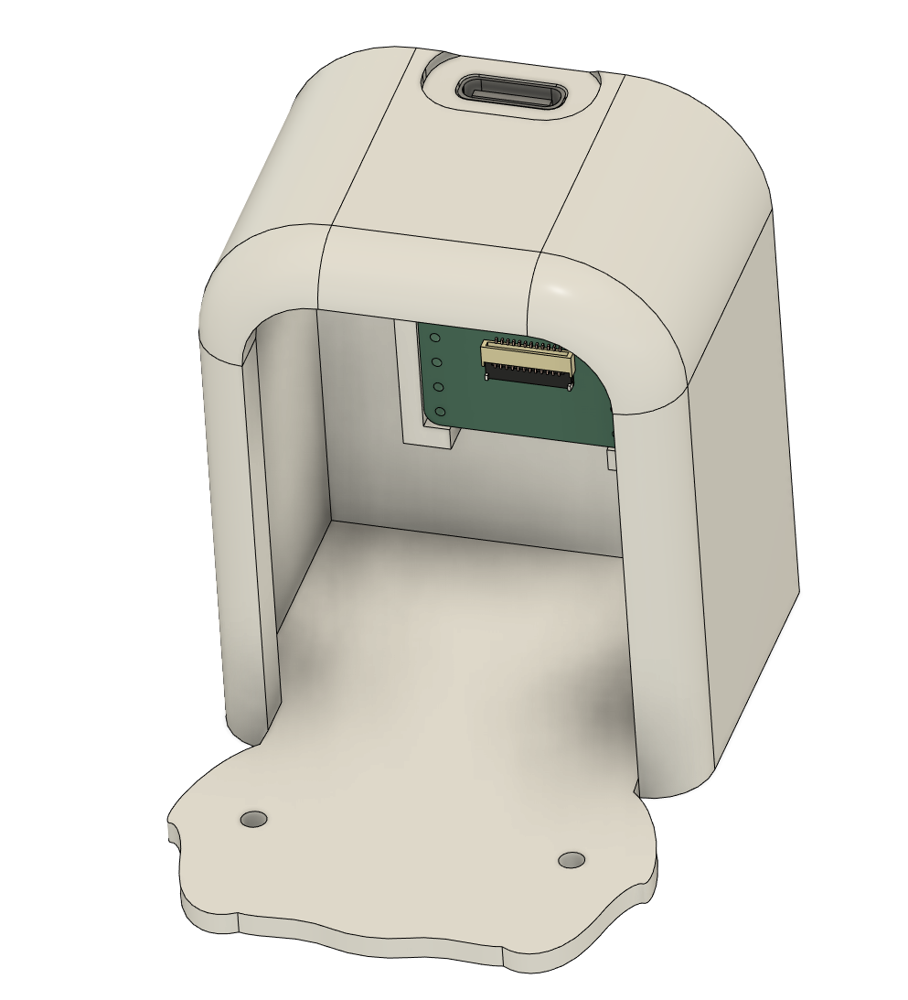
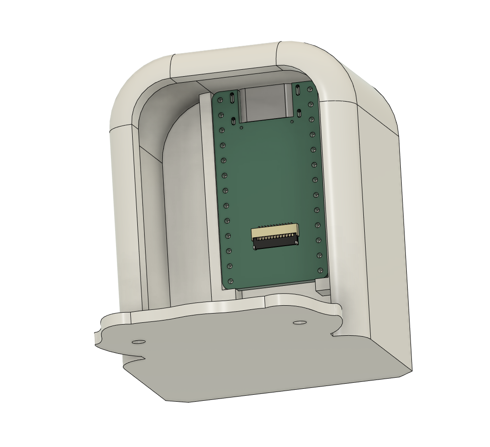

# trackball thumb helmet

https://github.com/sadekbaroudi/fingerpunch/assets/299248/0a0a54da-1fb9-476b-b6f7-2957c06ed985

## options

There are a couple of options to build one of these.  

Option 1: You can connect it to an existing keyboard with a VIK connector, and mount one of these to a case. See the dimensions below:

Option 2: You can use it as a standalone trackball. For a standalone trackball, you'll need to use the `trackball-thumb-helmet-vik-controller-optional-battery-backpack.stl`

## bill of materials

To make one of these, you need the following:
* 3D prints of a housing and a backplate or backpack from the STLs in this folder
* M2 4mm Diameter and 4mm Length heat set inserts
* A [vik pmw3360](https://github.com/sadekbaroudi/vik/tree/master/pcb/pmw3360), [vik pmw3360-xs](https://github.com/sadekbaroudi/vik/tree/master/pcb/pmw3360-xs), or [vik pmw3610](https://github.com/sadekbaroudi/vik/tree/master/pcb/pmw3610) module
* A pmw3360 or pmw3610 optical sensor (depending on which vik module you're using)
* A 34mm trackball
* 2x [M2 mounting screws](images/M2-mounting-screws.png)
* 2x 4mm M2 screws

## images

### thumb helmet pmw3360

  

### thumb helmet pmw3360-xs

 
 

### thumb helmet with vik controller

 
 
 

