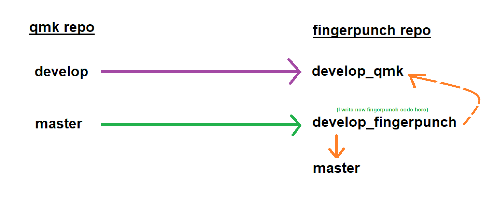
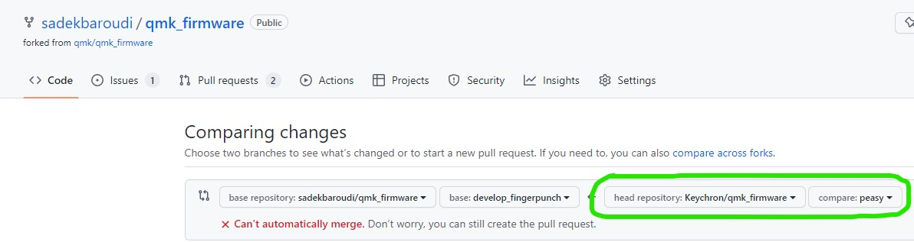

# Firmware

QMK repo: https://github.com/qmk/qmk_firmware
fingerpunch repo: https://github.com/sadekbaroudi/qmk_firmware

Branches
* master - stable, synced with qmk master, but adds the fingerpunch keyboards ( keyboards/fingerpunch/ directory )
* develop_fingerpunch - relatively stable, synced with qmk master, but contains new fingerpunch specific changes only, no changes to qmk itself...
* develop_qmk - synced with qmk develop, contains all the latest qmk changes only, along with the fingerpunch folder ( keyboards/fingerpunch/ directory )



## Building firmware

### STeMCell or other controllers

For other controllers, you can use the CONVERT_TO build parameter:
https://github.com/qmk/qmk_firmware/blob/master/docs/feature_converters.md

So, for example, for the STeMCell, you can add CONVERT_TO=stemcell at the end of your build string

Also note that stemcell uses tinyuf2, so you'll want to use the .uf2 file instead of the .bin or .hex file as you would with other controllers

### One time build

Starting with no repository, here's an example of building stock ffkb firmware with rgbmatrix and ec11 encoders:
```bash
# Cloning the repo
git clone git@github.com:sadekbaroudi/qmk_firmware.git
cd qmk_firmware
git submodule update --init --recursive
# Checking out the stemcell repo
git submodule update
# Running the firmware build
make fingerpunch/ffkb_byomcu/rgbmatrix_ec11:default

# Build firmware will be .build/fingerpunch_ffkb_byomcu_rgbmatrix_ec11_default.hex
# Copy the hex file and use QMK toolbox to load it
# If using a uf2, copy the uf2 file somewhere where you can drag and drop it to flash your STeMcell
```

### Managing fingerpunch code in your repository

Now, you may ask yourself the question: "But how do I organize and manage my code in there?"

My recommendation is to add my repo as a remote repository to yours. So, instead of cloning my repo, add it to yours using "git remote"

Note that you can do the below multiple times for different keyboards by replacing the branch name ffkb with whatever you like. You will not need to repeat the "git remote add" command once you have run it the first time.

```bash
# Add the fingerpunch repo as a remote repository
git remote add fingerpunch git@github.com:sadekbaroudi/qmk_firmware.git
git fetch fingerpunch

# Checkout the master branch as a branch that tracks your keyboard. Let's use ffkb in this example
git checkout -b ffkb fingerpunch/master
git submodule update

# add your keymap, code, etc into keyboards/fingerpunch/ffkb_byomcu/keymaps/{your_keymap_dir}

# commit your changes
git commit -a -m "Your commit message"

# push the branch to your repo
git push origin ffkb

# If you ever want to update from the latest fingerpunch stemcell branch in the future
git fetch fingerpunch
git merge fingerpunch/master
git push origin ffkb
```

## Contributing

Note that I will only accept fingerpunch changes (in the keyboards/fingerpunch/ directory), which go into the develop_fingerpunch branch. If there are changes outside of that, they should be pull requests into qmk directly.

If you'd like to contribute, you can do the following:
```bash
# ...in your qmk cloned repository
# If you haven't already, create a remote of the fingerpunch repo
git add remote fingerpunch git@github.com:sadekbaroudi/qmk_firmware.git
git fetch fingerpunch

# Checkout a feature branch based on develop_fingerpunch
git checkout -b features/fingerpunch/YOUR_FEATURE_BRANCH_NAME fingerpunch/develop_fingerpunch

# Make your changes

# Commit your changes
git commit -a -m "YOUR COMMIT MESSAGE"

# Push your changes to your fork
git push origin features/fingerpunch/YOUR_FEATURE_BRANCH_NAME

# Submit your pull request on github (see below)
```

Once you have your branch in your fork, you can go to the pull requests page for my repo:

https://github.com/sadekbaroudi/qmk_firmware/compare/sadekbaroudi:develop_fingerpunch...Keychron:qmk_firmware:audio_out

You'll need to change the head repository and branch to yours (circled in green below)

Please fill in a sensible description to explain what you are changing and why!



Submit the pull request and notify me to review.