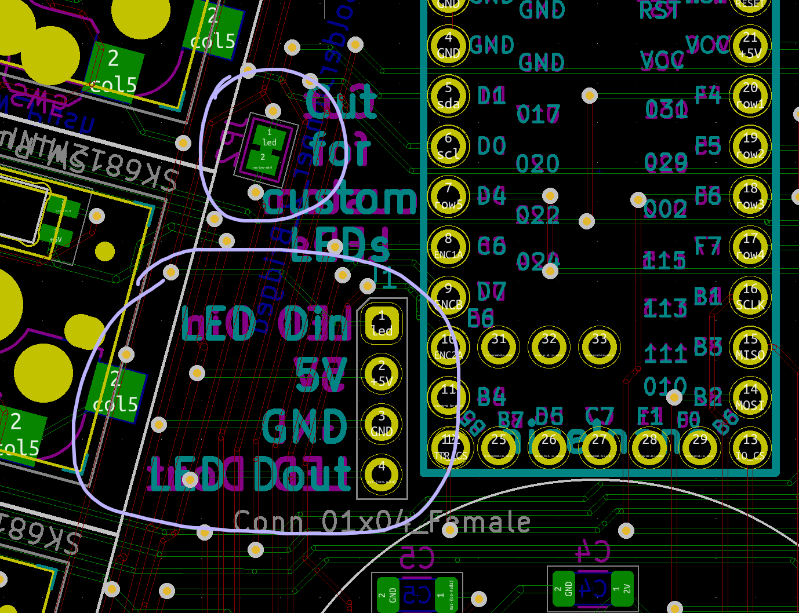

# ffkb

## BUILDGUIDE

For the ffkb, the feature support is almost identical to the Rock On. Please see the build guide and video for that keyboard, and follow the same general steps.

https://github.com/sadekbaroudi/fingerpunch/blob/master/rock-on/v2/BUILDGUIDE.md

## Pre-steps
* If using a STeMcell, before doing anything, see https://github.com/sadekbaroudi/fingerpunch/blob/master/stemcell/README.md#stemcell-jumpers
* Remove the R1 resistor from the back of the cirque trackpad. This enables I2C on the trackpad, which is required for the fingerpunch builds. It's a very small resistor, so please do so carefully.
* Note the controller you are using. If the usb-c port is a top-mount, you'll need headers that are on the shorter side (2.0mm to 2.5mm). So, if you are using header sockets, be sure they are not the ones that are within that range (or very close). These are a good example of header sockets that should work: https://www.digikey.com/en/products/detail/mill-max-manufacturing-corp./315-47-110-41-004000/8575758 ). If you are using a controller with a mid-mount usb-c, you can use taller headers if you like. These are quite cheap, and work great! https://www.amazon.com/Uxcell-a14081900ux0270-Single-Straight-Header/dp/B012ACSO4Y/ref=sr_1_5?crid=30WJXVFBSYL06&keywords=socket+headers&qid=1653820919&sprefix=socket+headers%2Caps%2C131&sr=8-5

## Other notes
* If using a fingerpunch case, the cases are ever so slightly off at the columns towards the outside. To make it easier to assemble, put the switches into the case first, and then press the pcb into the switches. You may need to flex the PCB a bit for the outer switches. This is perfectly fine!
* If using a wireless build, you can use any 3 pin through hole on/off switch with 2.0mm spacing. I have the footprint set up for this one: https://www.digikey.com/en/products/detail/c-k/OS102011MA1QN1/1981430

## Custom LEDs

As of the ffkb v3 and ffkb v2 ks-27 switch edition, you can now add your own individually addressible LEDs using the LED breakout section.

To do so, wire as follows:
* Din on the ffkb pcb to the data in of your first led
* GND to GND of your first led
* 5v to VCC of your first led (note that if the controller you are using is a 3.3v controller, this 5V pin will match your conroller)
* Wire the last LED data out to the Dout on the ffkb pcb. This step is not necessary if you are not using the per key leds on the ffkb pcb.

## BOM

### ffkb v2 case

* (a) 8 M2 heat set inserts (4mm) OR (b) 8 M2 standoffs (8mm)
* (a) 8 M2 screws (4-5mm) OR (b) 16 M2 screws (5mm)
  * Note that you need either both (a)s or both (b)s

### ffkb v1 case

* (a) 9x 10mm-11mm M2 standoffs AND (b) 18 M2 screws (5mm)

### Irrespective of case

* MCU headers (2x 12pos and 1x 5pos for elite-c or stemcell, 2x 12pos and 1x 3pos for nice!nano)
  * Please test the header height before soldering them on to make sure that it all lines up correctly!
* MCU
  * You can use an elite-c, nice!nano, or STeMcell. The STeMcell repo is here, and I highly recommend it! https://github.com/megamind4089/STeMCell
  * Note, if you are using a cirque, as of this writing (2022-05), you cannot use an elite-c. There is a known issue with AVR based processors and the cirque trackpad.
* 36 switches or 42 switches (5 column vs 6 column). PCB supports both choc and MX switches
* 36 hotswap sockets or 42 hotswap sockets (5 column vs 6 column). PCB supports both choc and MX switches
* (optional) 36 or 42 SK6812 mini-e leds for per key rgb
* (optional) 35mm cirque trackpad and 12pin 0.5mm pitch ffc cable
* (optional) 0.96 inch OLED
  * If using an the V2 case and an OLED, you should *not* solder the headers on the OLED such that they are flush with the pcb. On a MX build, there is a 10mm gap between the pcb and the underside of the case where the OLED will rest. So, it will sit too low and will not be sitting flush with the OLED hole in the case. I suggest using the socket below, as it's tall and will allow you to adjust the height of the OLED by cutting the pre-soldered pins on the OLED itself to rest at the right height to sit flush with the Rock On case. See "Reference image 1" below
  * https://www.digikey.com/en/products/detail/sullins-connector-solutions/PPPC121LFBN-RC/810184?utm_adgroup=&utm_source=google&utm_medium=cpc&utm_campaign=Shopping_DK%2BSupplier_Tier%202%20-%20Block%202&utm_term=&utm_content=&gclid=CjwKCAjwjtOTBhAvEiwASG4bCBAySUG3bc8MOYVl8rFdJTeJl8H1ZVGDSXxpFjlF3NGdhI6gDOlicxoCk4gQAvD_BwE
* (optional) 2x EC11 or evqwgd001 rotary encoders
* (optional) 1x EC11 encoder for the center

* NOTE: you can only use one center component with the fingerpunch ffkb cases. That means OLED or Pimoroni or EC11 (center one) or cirque trackpad.

Reference image 1:

