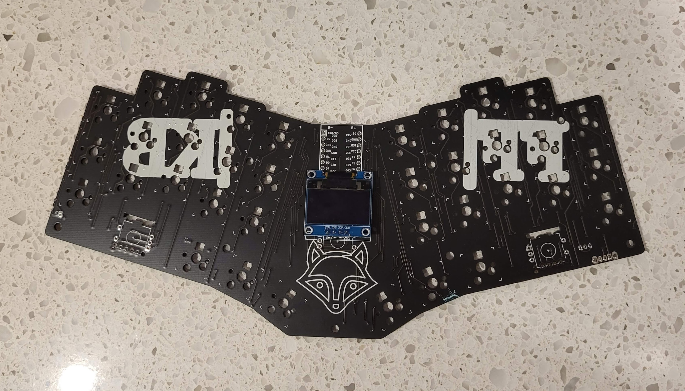
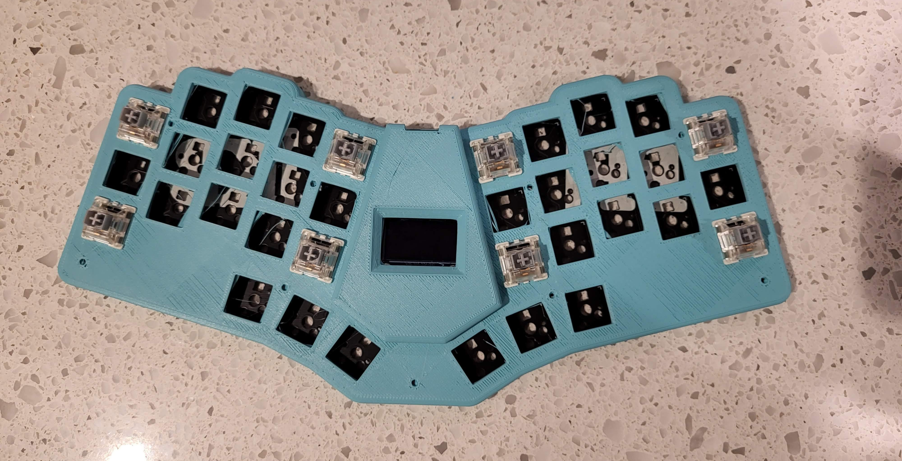
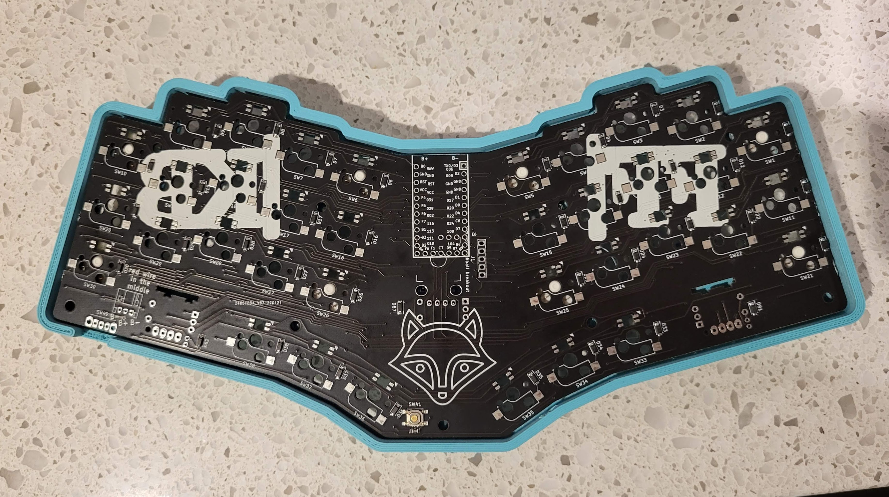

# Build notes

## OLED on low pro case

First you want to put the OLED onto the pcb

***

Now you want to put 6 switches or so into the case to make sure the pcb is in the correct position

***

Place the pcb into the case. This means that the OLED will be in the correct depth. Solder only 1 pin. Flip the board over to make sure that the OLED looks right. If it's a bit off, heat up the pin you soldered and move the OLED a bit. Repeat this until the OLED looks correct from the top. Now, solder the other 3 pins on the OLED

