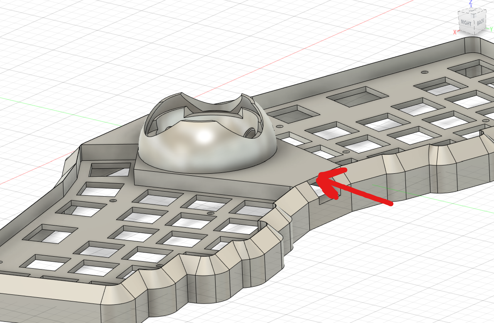
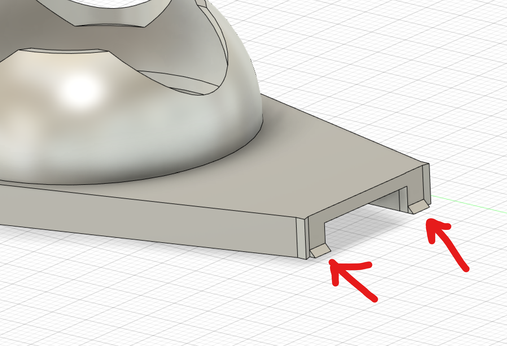
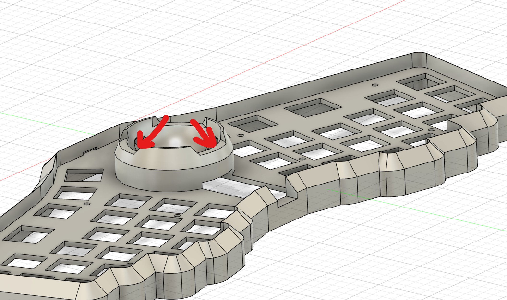

# ffkb v3 case (made for the trackball)

## high profile

For this case, you will need to print a few things:
* 1x - The case body
* 1x - Bottom plate
* 1x - The trackball housing (if you use the modular case)
* 1x - The trackball cover
* 3x - BTU 4mm ball housing

Note: For the BTU 4mm ball housing, you can buy these instead. My model is designed for these: https://www.aliexpress.com/item/3256802880089745.html?spm=a2g0o.order_list.0.0.187d18028Js9tO

For assembly materials, you will need:
* 8x M2 standoffs, 8mm
* 16x M2 screws, 4mm or 5mm
* 3x 4mm steel or nylon balls (included in the trackball kit)
* 34mm trackball

### case body and bottom plate

For the case body, you can choose to make a modular case, or a case with the built in BTU trackball housing.

The file format is:
ff-h2-{5|6}-tr-{ne|ec|ev}-{BTU|modular}.stl

* 5|6 - number of columns (as of this writing, only 6 column support)
* ne|ec|ev - no encoders, ec11, or evq roller encoders
* BTU|modular - BTU trackball housing built in, or modular to support future features

For the bottom plate, you can use the ffkb v2 high pro case bottom plate (5 or 6 column)

### trackball housing

If you use the modular, you will also need to print the trackball-housing.stl in the trackball directory

### trackball cover

Print btu-4mm-ball-housing.stl

### BTU 4mm ball housing

Print btu-4mm-ball-housing.stl in the trackball directory

### BTU housing balls (4mm)

I have now tested 4 different solutions for trackballs.
* BTUs from aliexpress spin the best, but are the loudest - https://www.aliexpress.com/item/3256802880089745.html?spm=a2g0o.order_list.0.0.31b71802lRzugJ
* BTU housing stl with nylon spin second best, and sound is much quieter (pretty close second) - https://www.amazon.com/dp/B09CD8JPXB?psc=1&ref=ppx_yo2ov_dt_b_product_details
* BTU housing stl with steel is third best, and a little noisier than nylon, but still quiet - https://www.amazon.com/dp/B07YKQN9TN?psc=1&ref=ppx_yo2ov_dt_b_product_details
* BTU housing stl with PP comes in last, but not much worse than steel - https://www.amazon.com/dp/B08FG2TZ56?psc=1&ref=ppx_yo2ov_dt_b_product_details

I have some ceramic ones on the way, will test those too.  https://www.aliexpress.com/item/2255799954930564.html?spm=a2g0o.order_list.0.0.31b71802lRzugJ

Honestly, all good options. No major complaints. If you want the super spin, and don't mind the noise, go with the aliexpress ones. Otherwise, any of the others are just fine.

## Assembly

### Pre trackball assembly

1) (if you have a trackball housing with the built in BTUs, you can skip this step) With the BTU 4mm ball housing or the purchased BTU into the trackball housing. It will require a bit of force, but it's a press fit and should not come out.

### Trackball assembly

First of all, you should understand how to place and remove the trackball cover. You need to squeeze the edge in the picture below, and lift to remove the cover.

To place it, put the bottom side into the notch int the case, and then squeeze that same edge and push down.

You can see there are tiny notches that hold it in place

Place the BTUs or the 4mm balls into the BTUs shown below. Please note that the balls will fall out easily. So you want to place them in while keeping the trackball housing level. Then place the trackball on top. Once the trackball is in, they won't fall out unless you take the ball out.

Before you reassemble, make sure you remove the protective cover from the sensor, and you place the lens on top (shown below). It should only fit one way, so be sure it snaps into place.

### Post trackball assembly

1) Screw the standoffs into the top body
2) Put the fully assembled PCB into the case through the standoffs, with the switches and keycaps
3) Plug in the keyboard and test everything
4) Screw in the bottom plate

