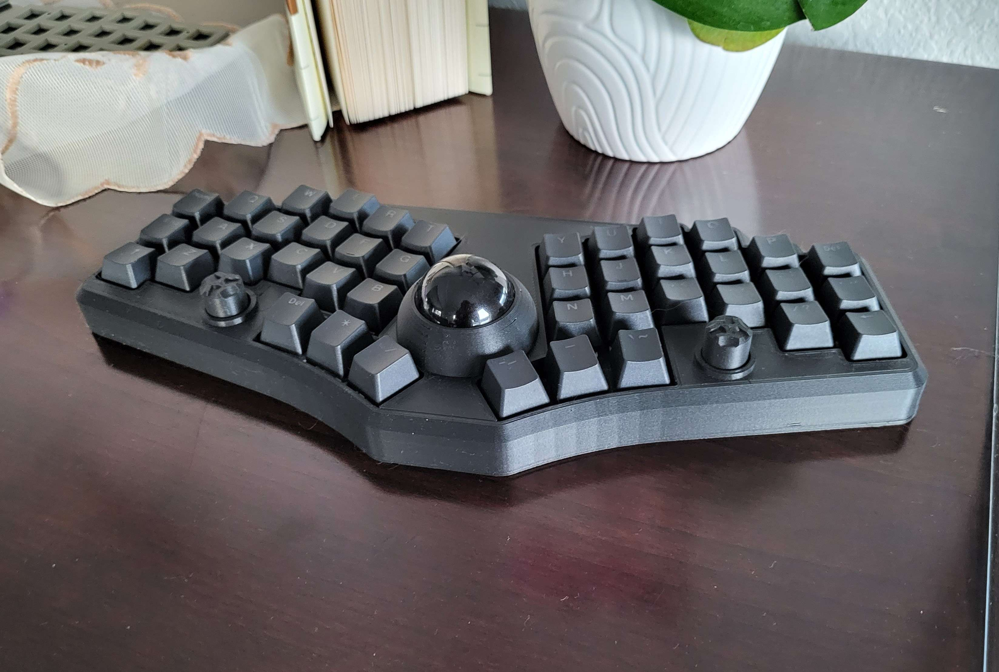
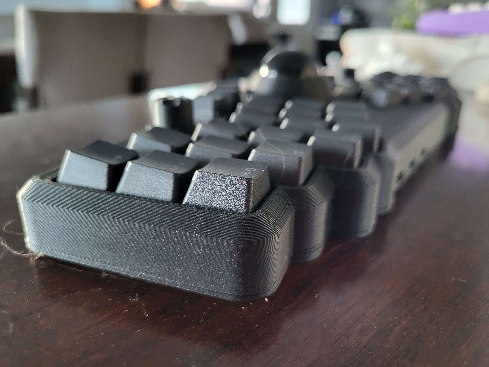
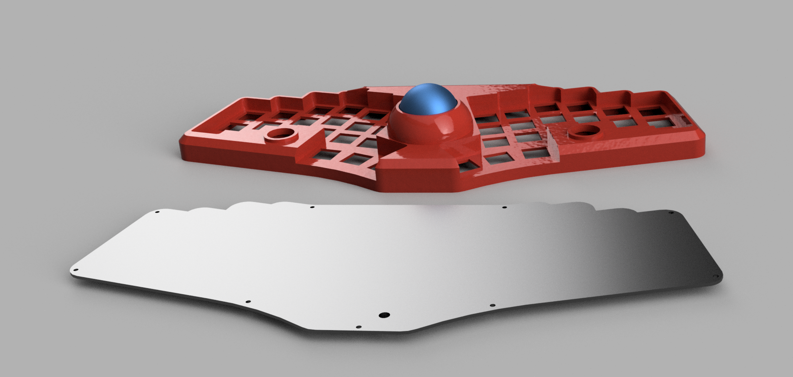
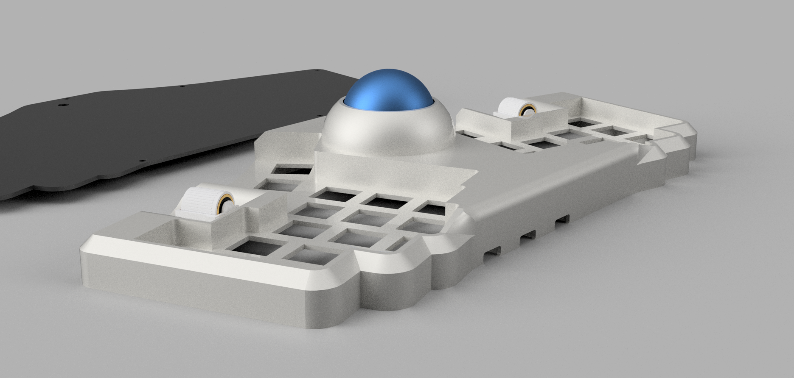

# ffkb v3 rp2040 usb-hub edition

# bom

> **Note**
> This list is only for the case build, but not the entire ffkb keyboard build. You'll still need the ffkb pcb and all the components required for a typical ffkb build. See the [ffkb v3 rp2040 usb-hub product page](https://fingerpunch.xyz/product/faux-fox-keyboard-v3-rp2040-hub)

To build this style case, you'll need:
* one of the case bodies
* the trackball holder
* the trackball cover
* bottom plate
* 8x - 8mm diameter by 3mm magnets
* 9x - 5mm M2 screws
* 9x - M2 4mm heat set inserts

# pictures

## 6 column

## mx trackball case with ec11 cutouts

# renders

## 6 column

### choc trackball case with ec11 cutouts

### choc trackball case with evq cutouts

## 5 column

### choc trackball case with evq cutouts

