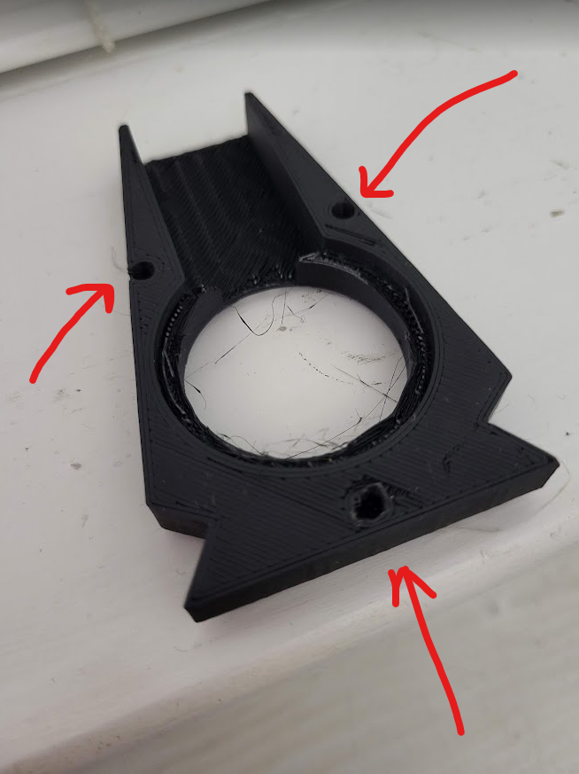
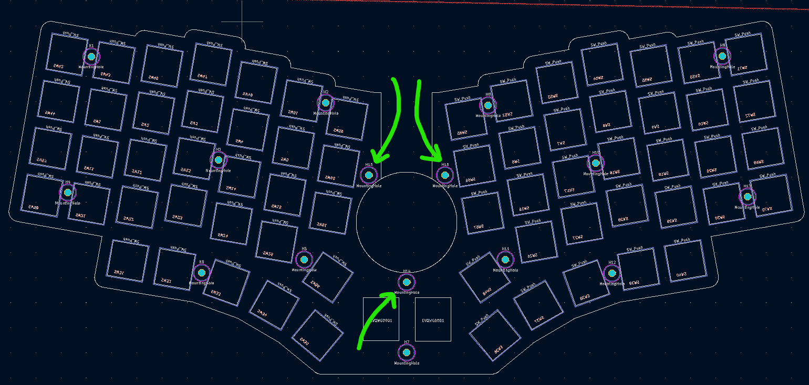
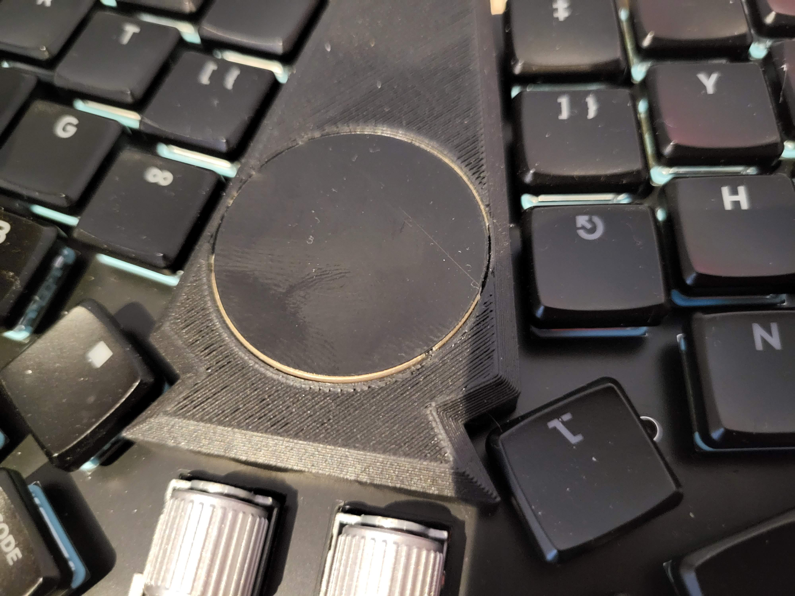
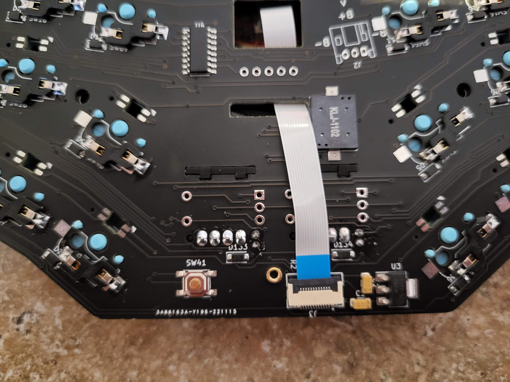
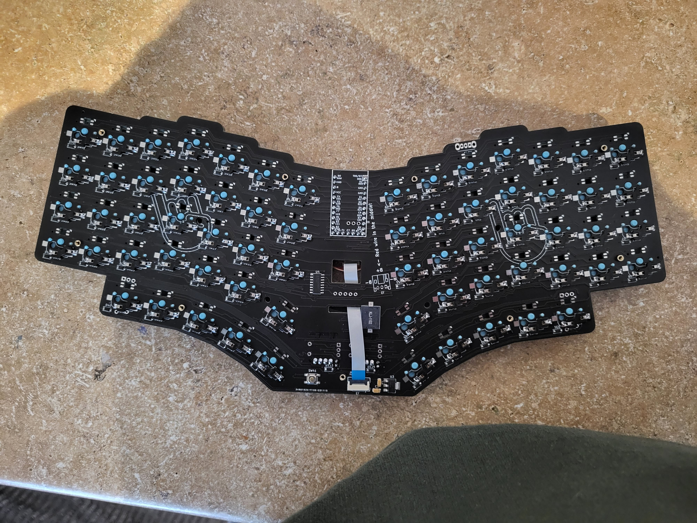

# Pinkies Out v2

Generally, the build process for the Pinkies Out v2 is similar to the Rock On v2 in terms of soldering:
https://www.youtube.com/watch?v=LKTFEaT3yzU&ab_channel=fingerpunch

## Pre-steps
* If using a STeMcell, before doing anything, see https://github.com/sadekbaroudi/fingerpunch/tree/master/controllers/stemcell/README.md#stemcell-jumpers
* Remove the R1 resistor from the back of the trackpad. This enables I2C on the trackpad, which is required for the fingerpunch builds. It's a very small resistor, so please do so carefully. See video: https://www.youtube.com/watch?v=X1Lgvs7PZt4&t=535s
* It's very likely you'll need to remove the overlay on the cirque, as they generally cause issues. You can test it first to see if it does work, but if not, you can see this video on how to remove it: https://www.youtube.com/watch?v=_9lTZ1vEtGA&ab_channel=fingerpunch
* Please read step 12 below. If you're going to take approach 12.3, you'll need to adjust the order of assembly, as described in that step.

## Other notes
* If you are using a cirque, please note that firmware compiled with cirque support will *NOT* work if the cirque is not connected. Key presses won't register, etc. So please test with non-cirque firmware if it's not connected, or connect it if using cirque firmware.

## BOM
* Pinkies Out FR-4 plates
* (3) M2 4mm heat set inserts
* (3) M2 3-4mm screws (must be flat head if building a choc pcb)
* (18 to 26) M2 screws (4mm)
* (9 to 13) M2 standoffs (5mm)
* MCU headers (2x 12pos and 1x 5pos for elite-c or stemcell, 2x 12pos and 1x 3pos for nice!nano)
* 66 MX or choc switches
* 66 kailh hotswap sockets
* (optional) cirque trackpad, 35mm
* (optional) ffc cable, 12 pin, 0.5mm pitch (to connect trackpad to pcb)
* (optional) 66 SK6812 mini-e leds for per key rgb
* (optional) 35mm cirque trackpad and 12pin 0.5mm pitch ffc cable
* (optional) 2x EC11 or EVQ rotary encoders

## Reference images with details

1) Install the 3 heat set inserts into the cirque holder. You line up the heat set insert with the hole, and heat it up with a soldering iron and press down until it sits flush with the surface.

2) Place the cirque holder on the top plate, and screw it in from the bottom side of the plate using 3 M2 screws (remember, flat head if a choc switch build)

3) At this point, it should be securely attached to the top plate

4) Solder all the hotswap sockets and leds, as shown in the rock on build guide video

5) Solder the controller to the pcb, as shown in the rock on build guide video

6) Solder the EC11 or EVQ rotary encoders.

7) Connect the cable to the clamshell connector. See the image below for how it should look like for steps 6 and 7.

This is what a fully assembled PCB will look like from the back

8) Now you put the top plate on top of the pcb and start inserting switches. Do not put the keycaps on yet, as you'll need to install the M2 standoffs and screws

9) When complete, put the the rest of the M2 standoffs through the holes in the PCB from the bottom, and screw the M2 screws in from the top switch plate. You only need to srew in the 9 screws around the perimeter of the board, but the remaining 4 in the center will give it even more rigidity.

10) Push the cirque trackpad cable through the hole in the pcb, and attach the cirque to the other side.

11) Screw in the bottom plate into the standoffs tha you set up in step 9

12) Securing the cirque trackpad to the 3D printed holder is a bit tricky. There are a few approaches.  

12.1)  Generally, super glue works very well. However, if you use that, it's not easy to remove. Also, once you super glue a pcb, you should never solder it again due to the toxins in the glue that are exposed on heating.  

12.2) The other approach is hot glue. It increases the height of the trackpad a bit, so it won't be flush with the mount. That said, it's easy to remove, and can be cleaned up from the PCB and 3D printed part.

12.3) I've never tried this, but I've heard you can use a strong tape to attach the cirque to the mount from the inside. If you take this approach, you need to attach the cable to the cirque first and do it before you attach the top plate to the pcb. Make sure you run the cable through the hole as you're placing the plate onto the PCB.

13) Put your keycaps on and plug it in!

Fully assembled board:

## Firmware

For QMK, see:
https://github.com/sadekbaroudi/qmk_firmware/tree/master/keyboards/fingerpunch/pinkiesout/v2

For Vial, see:
https://github.com/sadekbaroudi/vial-qmk/tree/master/keyboards/fingerpunch/pinkiesout/v2

