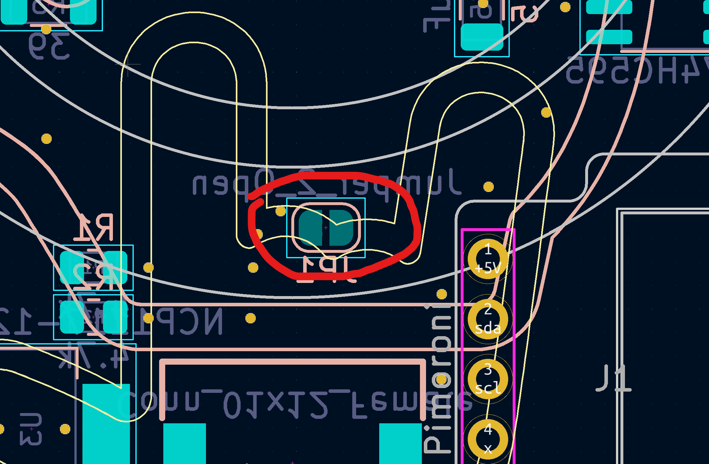

# Rock On v3

## Bottom center rotary encoder

On the v3.1, there is a rotary encoder position in the center.

If you choose to use this, you cannot use the audio feature, as they share a pin. You will also need to solder the jumper shown below.
When compiling firmware, make sure you don't include `AUDIO_ENABLE=yes`, or the encoder won't work.

