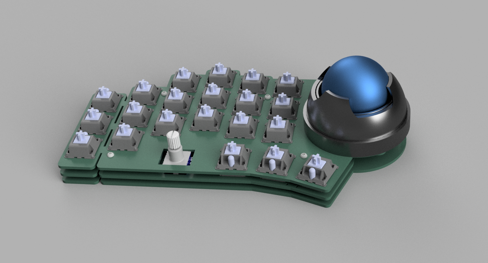
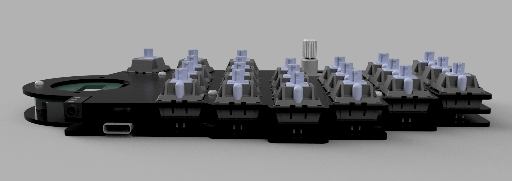
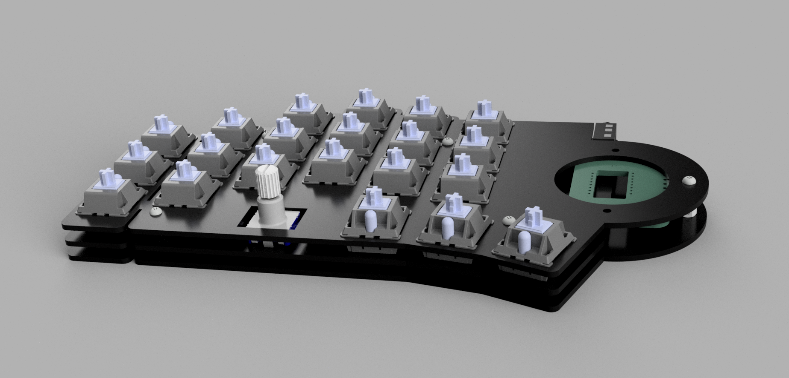
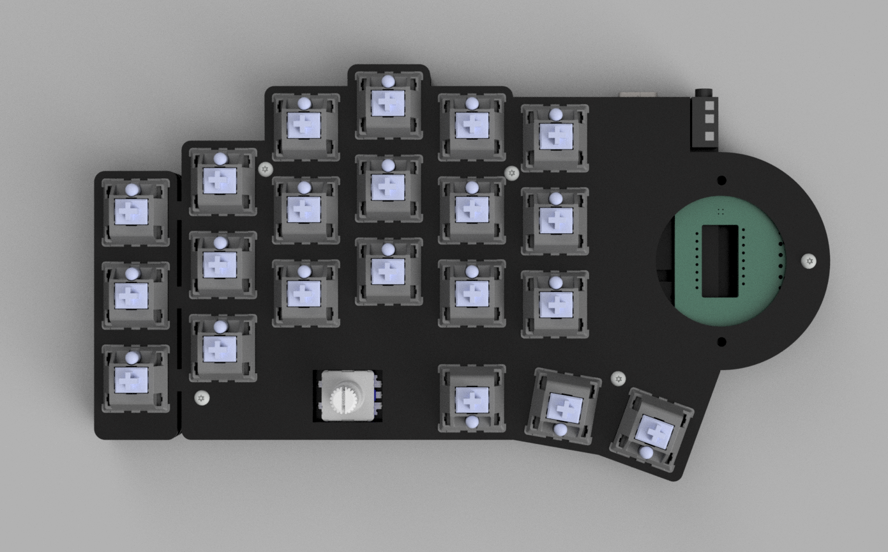

# ximi fr-4 plates

This includes FR-4 plates to allow you to assemble the ximi pcb with plates, along with the ability to add a modular attachment for the pointing device.

# bom

> **Note**
> This list is only for the case build, but not the entire ximi keyboard build. You'll still need the ximi pcb, trackball sensor pcb, and all the components required for a typical ximi build. See the [ximi product page](https://fingerpunch.xyz/product/ximi/)

To build this style case, you'll need:
* 2 sets of FR-4 plates, found in the fr-4 directory
* 10x - 8mm M2 standoffs
* 20x - 5mm M2 screws + 2 per pointing device
* 2x - M2 4mm heat set inserts per pointing device
* 3D printed attachment per pointing device

# renders

