# Cylindrical Minimal Y (CMY)

These are keycaps that are a standard 18mm width, but only 15.4mm height. The intent is to have some comfortable keycaps to be used with keyboard designs that utilize minimal Y spacing.

There is support for the following switch types:  
* MX
* Choc v1
* KS-27 and KS-33

Note: I do not recommend these for keyboards that have standard 18mm vertical spacing. These will leave a gap between the keycaps, and will not be as comfortable. That said, you can definitely use them on standard spacing if you like!

## Build pics

MX:  
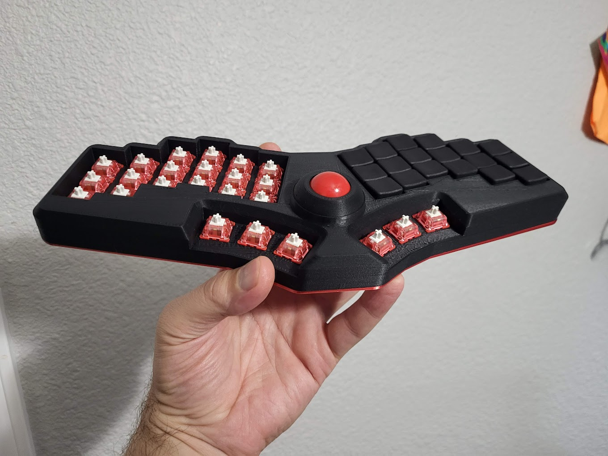

Choc:  
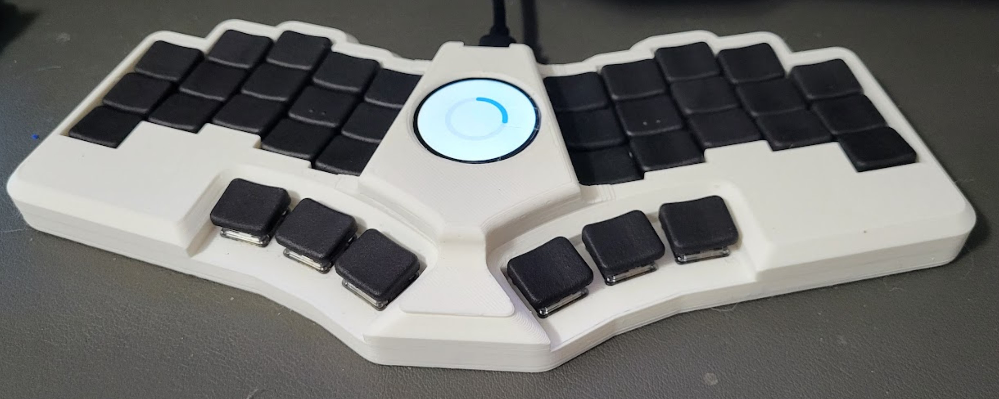

KS-33:  
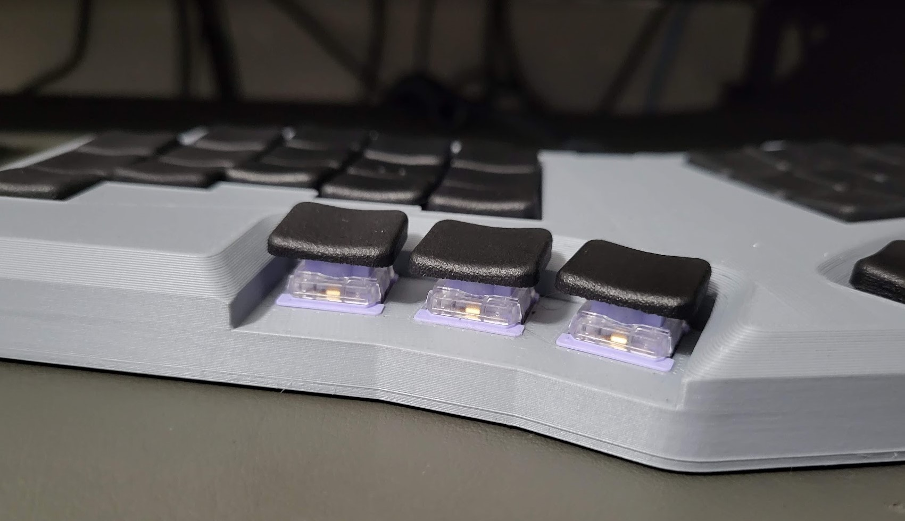

## Renders

For the renders below, note that non-sculpted thumbs are not pictured. If you'd like to use non-sculpted thumbs, you can use the 12 degree R2/R4 keys. They make for good thumb keys.

### Homing

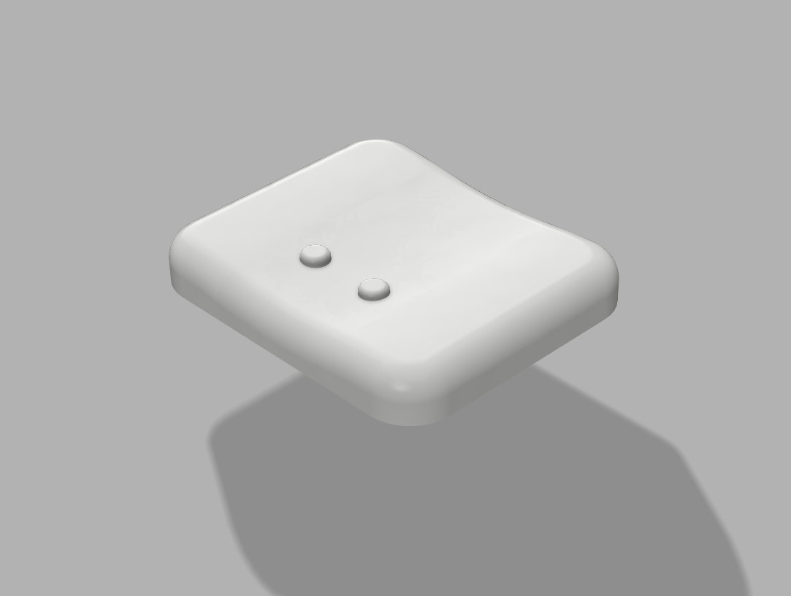

### 5 degree vertical tilt

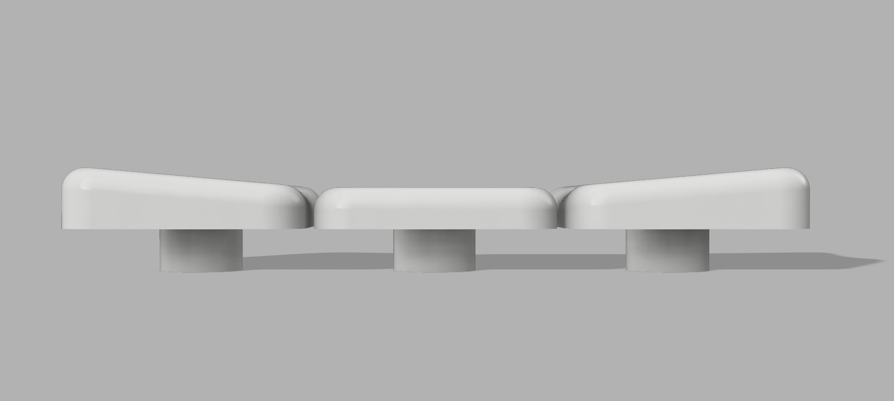

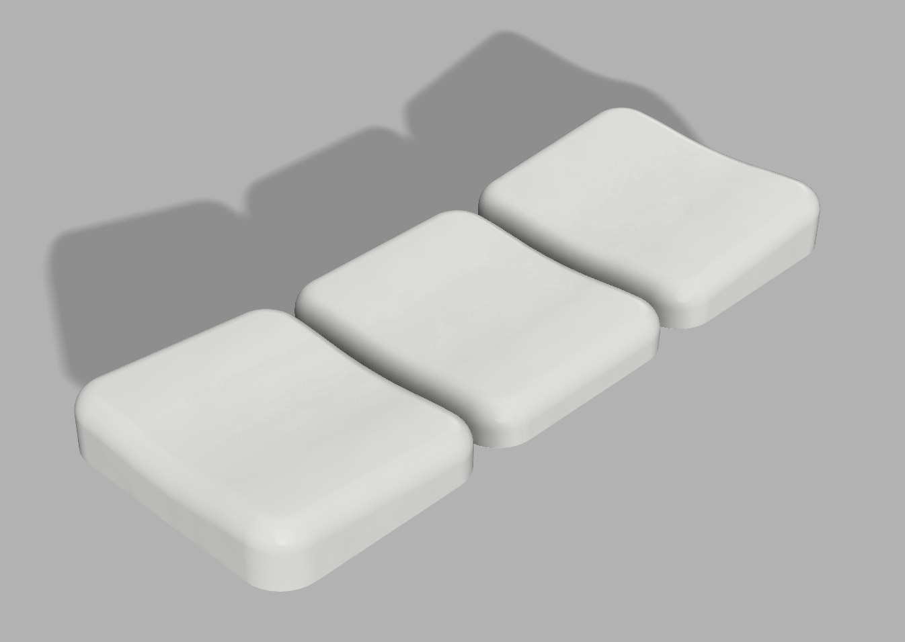

### 12 degree vertical tilt

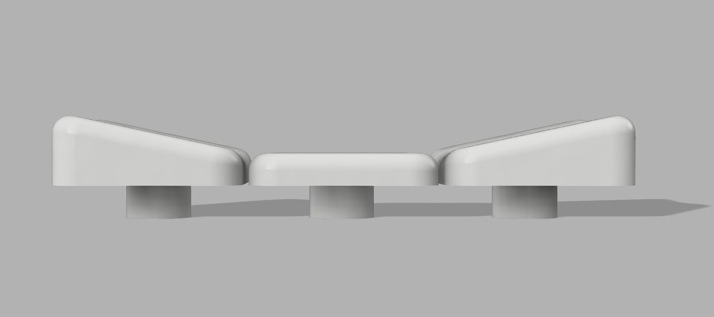

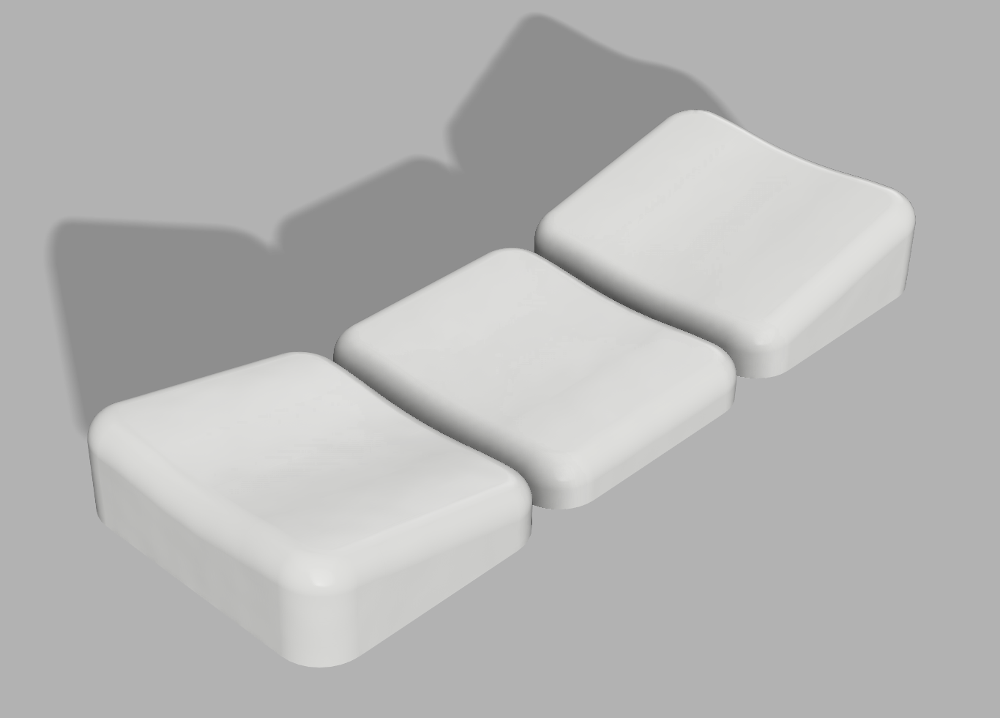

### 12 degree edge columns

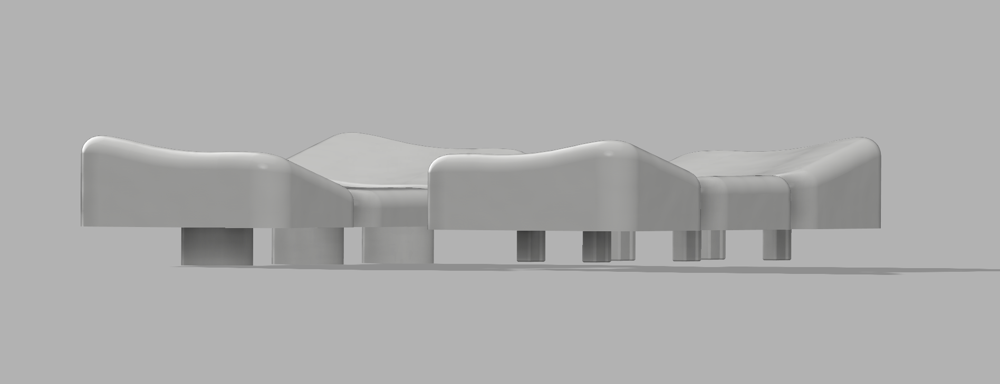

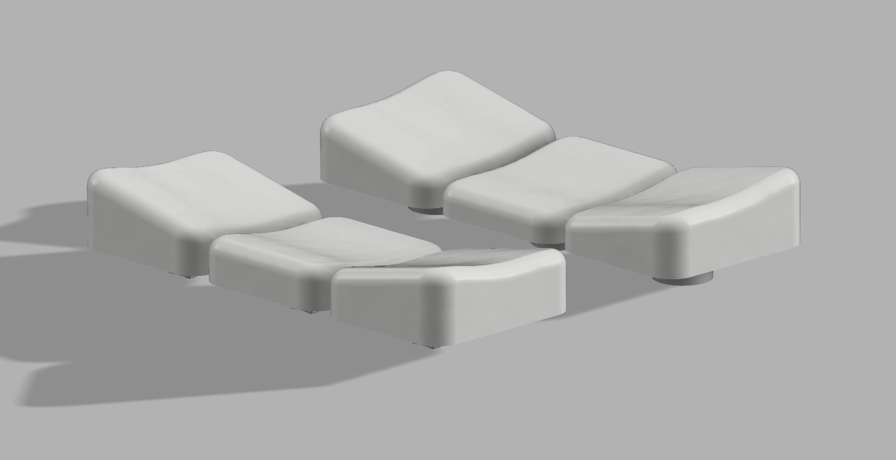

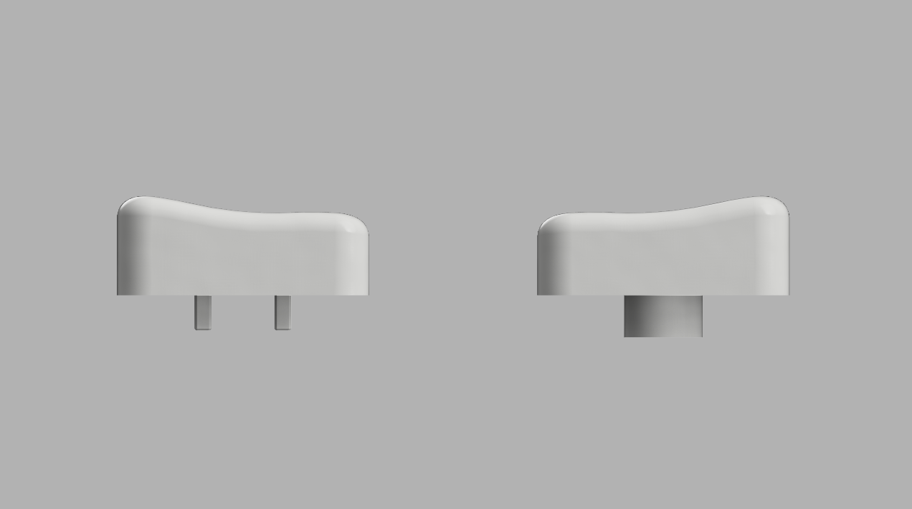

### 12 degree vertical tilt flat ends

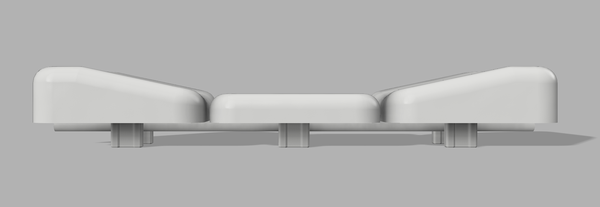

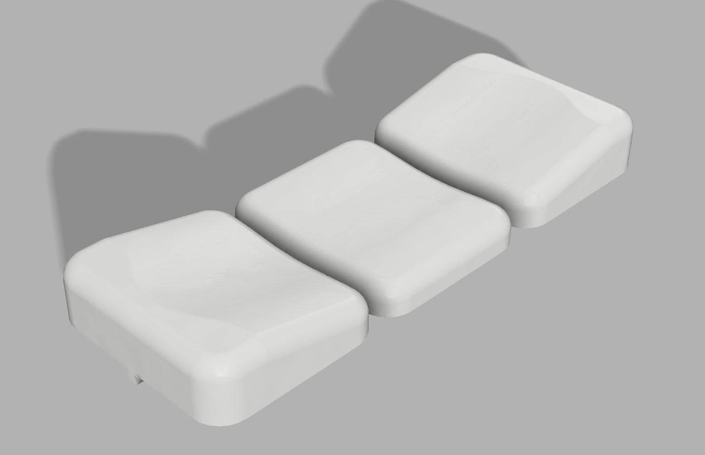

### Sculpted thumbs

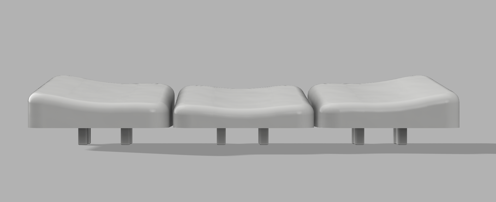

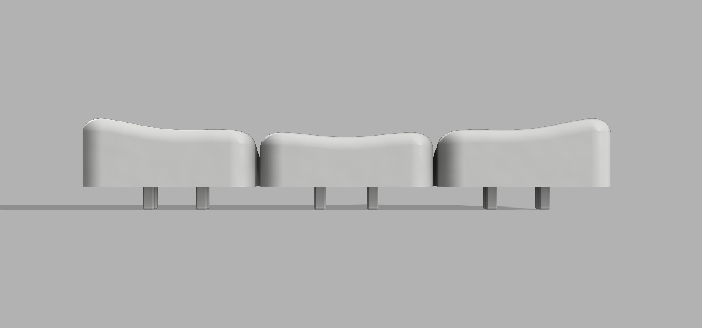

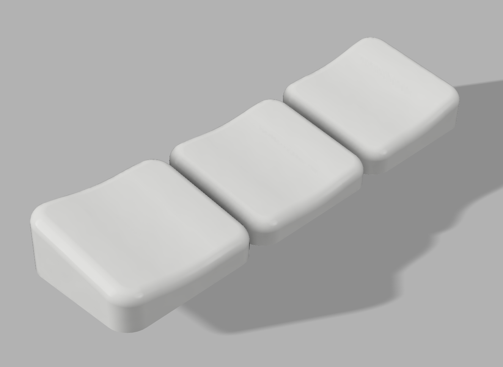
