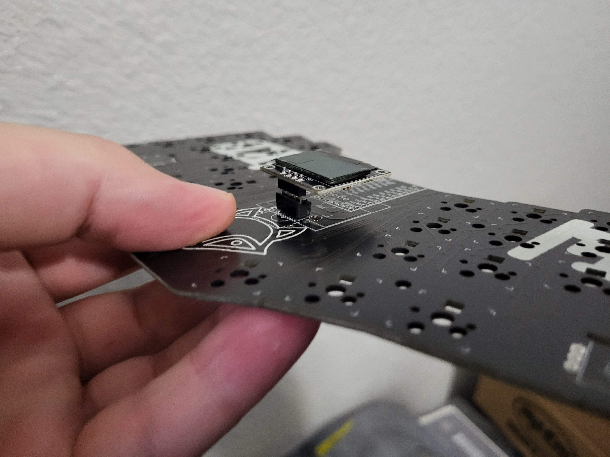

# Rock On

Build guide video:
https://www.youtube.com/watch?v=X1Lgvs7PZt4&ab_channel=fingerpunch

Pre-steps:
* If using a STeMcell, before doing anything, see reference image 2 below. You will need to solder these jumpers together, as circled in the image.
* Remove the R1 resistor from the back of the trackpad. This enables I2C on the trackpad, which is required for the fingerpunch builds. It's a very small resistor, so please do so carefully.

BOM:
* Rock On case
* (a) 10 M2 heat set inserts (4mm) OR (b) 12 M2 standoffs (8mm)
* (a) 10 M2 screws (5-6mm) OR (b) 24 M2 screws (5mm)
  * Note that you need either both (a)s or both (b)s
* MCU headers (2x 12pos and 1x 5pos for elite-c or stemcell, 2x 12pos and 1x 3pos for nice!nano)
  * IMPORTANT - The headers should be 2.0mm to 2.5mm, so if you are using header sockets, be sure they are not the ones that are within the range (or very close). These are a good example of header sockets that should work: https://www.digikey.com/en/products/detail/mill-max-manufacturing-corp./315-47-110-41-004000/8575758 )
* MCU
  * If blackpill edition, get the STM32F4x1 blackpill: https://github.com/WeActTC/MiniSTM32F4x1
  * If byo-mcu, you can use an elite-c, nice!nano, or STeMcell. The STeMcell repo is here, and I highly recommend it! https://github.com/megamind4089/STeMCell
  * Note, if you are using a cirque, as of this writing (2022-05), you cannot use an elite-c. There is a known issue with AVR based processors and the cirque trackpad.
* 66 MX switches or 64 MX switches if using under palm encoders
* 66 kailh hotswap sockets or 64 kailh hotswap sockets if using under palm encoders
* (optional) 66 SK6812 mini-e leds for per key rgb
* (optional) 35mm cirque trackpad and 12pin 0.5mm pitch ffc cable
* (optional) 0.96 inch OLED
  * If using an OLED, you should *not* solder the headers on the OLED such that they are flush with the pcb. On a MX build, there is a 10mm gap between the pcb and the underside of the case where the OLED will rest. So, it will sit too low and will not be sitting flush with the OLED hole in the case. I suggest using the socket below, as it's tall and will allow you to adjust the height of the OLED by cutting the pre-soldered pins on the OLED itself to rest at the right height to sit flush with the Rock On case. See "Reference image 1" below
  * https://www.digikey.com/en/products/detail/sullins-connector-solutions/PPPC121LFBN-RC/810184?utm_adgroup=&utm_source=google&utm_medium=cpc&utm_campaign=Shopping_DK%2BSupplier_Tier%202%20-%20Block%202&utm_term=&utm_content=&gclid=CjwKCAjwjtOTBhAvEiwASG4bCBAySUG3bc8MOYVl8rFdJTeJl8H1ZVGDSXxpFjlF3NGdhI6gDOlicxoCk4gQAvD_BwE
* (optional) 2x EC11 rotary encoders

Reference image 1:

Reference image 2:

