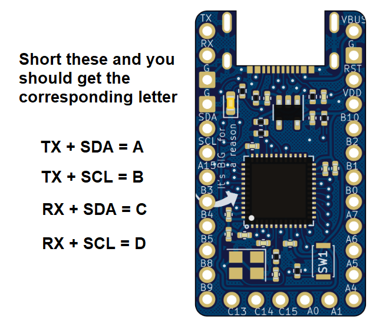

# Stemcell jumper tester

If you are concerned that you may have incorrectly soldered the jumpers on the back of the stemcell, you can use this firmware to test.

* Download the firmware in this git directory: fingerpunch_stemcell_jumper_tester_default_stemcell.uf2
* Load it onto your stemcell
* Short the pins shown in the image below

If it outputs what is expected, you did it!

